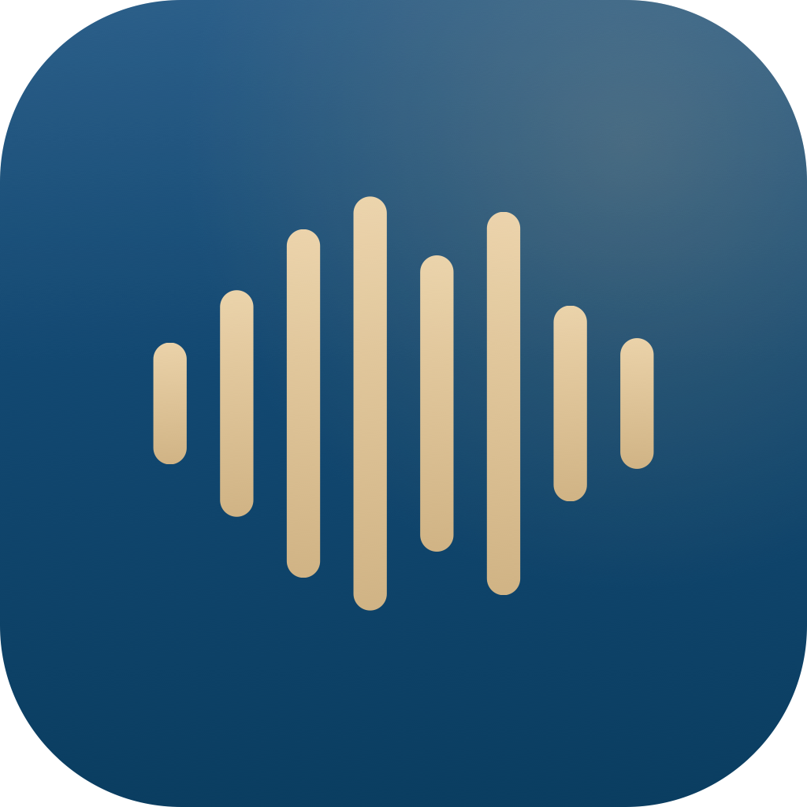

# Handsfree

Native macOS menubar dictation app. Hold a hotkey, speak, release: text appears at your cursor in any app. Works fully offline.



A privacy-first alternative to Wispr Flow / Superwhisper. Open source, DSGVO-konform, no telemetry, no account required. Built and maintained by [Lighthouse Consultings](https://lighthouseconsultings.de) as the demo project for the Claude Code + Codex workflow.

---

## Download

[**Latest release (DMG)**](https://github.com/Lighthouse-Consultings/handsfree/releases/latest/download/Handsfree.dmg) → drag to `/Applications`, open once, grant Mic + Accessibility.

Universal binary (Apple Silicon + Intel). macOS 14 (Sonoma) or newer.

For first-run install instructions, including macOS Gatekeeper handling for ad-hoc signed apps, see the `LIES_MICH.txt` inside the DMG.

---

## Modes

| Mode | Hotkey | What it does |
|---|---|---|
| **Raw** | `⌥ᴿ + ⇧` | 1:1 transcript, no LLM |
| **Polished** | `⌥ᴿ + ⌃` | Spoken style cleaned to written style (fillers removed, syntax tightened) |
| **Compose** | `⌥ᴿ + ⌥ᴸ` | Speak an instruction. Optional `⌘C` before triggering uses the clipboard as context. LLM writes the final text |
| **Emoji** | `⌥ᴿ + ⌘` | Original text with tasteful emojis added |

`⌥ᴿ` = Right-Option key (right of spacebar). Hold both, speak, release.

### Compose examples

```
No clipboard:
  Hotkey + "schreib eine Absage an Martin für Donnerstag, freundlich"
  → Full email appears at cursor

With clipboard (Cmd+C a passage first):
  Hotkey + "fass das in 3 Bulletpoints zusammen"
  → 3 bullets replace what you had
```

---

## Backends

Both transcription and LLM can run **fully locally**. Zero data leaves the Mac in that mode.

| Layer | Cloud option | Local option |
|---|---|---|
| **Transcription (STT)** | OpenAI `gpt-4o-transcribe` | `whisper.cpp` + ggml model (Tiny / Small / Turbo, 75 MB - 1,5 GB) |
| **LLM (Polished/Emoji/Compose)** | Anthropic `claude-sonnet-4-6` | Ollama + any local model (Gemma, Llama, …) |

Toggle in Settings. Raw mode works without any LLM backend at all.

API keys are stored in macOS Keychain (`WhenUnlockedThisDeviceOnly`, no iCloud sync). Local Whisper models can be downloaded directly from the in-app model picker — no Terminal needed.

---

## Privacy

- **No telemetry, no analytics, no crash reporter.** The app makes zero outbound connections in the background.
- Outbound traffic happens only on explicit user action: API calls to OpenAI/Anthropic when you trigger a hotkey with cloud backend selected, or model downloads from HuggingFace when you click "Laden" in Settings.
- Dictation content is **never logged** to disk or to the macOS Unified Log.
- API keys never leave the device except as `Authorization` headers to the configured cloud provider.
- Source code is open — verify the claims yourself.

---

## First run

Grant three macOS permissions (System Settings → Privacy & Security):

1. **Microphone** — prompted automatically on first dictation
2. **Accessibility** — required for global hotkeys + text injection. Add `Handsfree.app` manually.
3. **Input Monitoring** — optional, harmless to grant

Open the menubar popover → Settings → paste API keys, OR toggle to Local backends and download a Whisper model with one click.

---

## Build from source

Requirements: macOS 14+, Xcode 16, [xcodegen](https://github.com/yonaskolb/XcodeGen).

```bash
git clone https://github.com/Lighthouse-Consultings/handsfree.git
cd handsfree
brew install xcodegen
xcodegen generate
open Handsfree.xcodeproj
```

In Xcode: select target `Handsfree` → Signing & Capabilities → pick your Team (so Mic + Accessibility grants survive rebuilds) → ⌘R.

---

## Style Guide field

Settings has a free-text "Stil-Vorgaben" field. Content is appended to every LLM system prompt (both Anthropic and Ollama paths). Useful for persistent voice/branding instructions.

Example:

```
Immer Sie-Form, keine Em-Dashes.
Signatur: Beste Grüße, Nico Röpnack.
Fachbegriffe: Smartsheet (kein Leerzeichen), FEW Automotive.
```

Applied to Polished, Emoji, and Compose. Raw bypasses the LLM entirely and ignores the style guide.

---

## Security

Threat model and hardening notes live in [SECURITY.md](SECURITY.md). Highlights:

- Keychain with `WhenUnlockedThisDeviceOnly`, no iCloud sync
- Ephemeral `URLSession` per API client (no cookies / shared cache)
- Pasteboard saved before injection, restored after the target app consumes (change-count watch, not a fixed timer)
- LLM user input wrapped in delimiter blocks with prompt-injection guardrails
- Recording hard-capped at 60 seconds
- Control characters stripped from injected text
- Hardened runtime enabled

---

## Architecture

```
Handsfree/
├── App/             HandsfreeApp, AppDelegate, MenuBarController, MenuBarView, Orchestrator, AppStatus, SoundFX
├── Audio/           AudioRecorder (AVAudioEngine → 16 kHz mono Int16 WAV)
├── Hotkeys/         GlobalHotkeyManager (NSEvent flagsChanged, Right-Option + secondary modifier)
├── Transcription/   WhisperClient (OpenAI), LocalWhisperClient (whisper.cpp), WhisperModel, WhisperModelManager
├── Postprocess/     LLMClient (Anthropic), OllamaClient (localhost:11434)
├── Injection/       TextInjector (CGEvent Cmd+V + pasteboard save/restore)
├── Settings/        KeychainStore, Preferences, SettingsView
└── Models/          Mode enum, errors
```

See [CLAUDE.md](CLAUDE.md) for the full project brief used by coding agents on this repo.

---

## Release history

Full version log in [CHANGELOG.md](CHANGELOG.md). Latest: [v0.9.0](https://github.com/Lighthouse-Consultings/handsfree/releases/tag/v0.9.0).

---

## Known limitations

- **Ad-hoc code signing** resets Accessibility / Input Monitoring permission on every version bump. The grant survives once the user re-adds the new binary in System Settings. Eliminating this requires Apple Developer ID.
- **Bundled `whisper-cli` is arm64-only.** Intel Macs can still use Cloud Whisper, or build whisper.cpp from source.
- **Ollama must be running** for local LLM (`brew services list` should show ollama as `started`).
- **No text-to-speech** — Handsfree is one-way (voice → text), no read-back.

---

## Contributing

Issues and PRs welcome. Please open an issue first for non-trivial changes so we can align on scope.

---

## License

[MIT](LICENSE) © 2026 Lighthouse Consultings GmbH.
